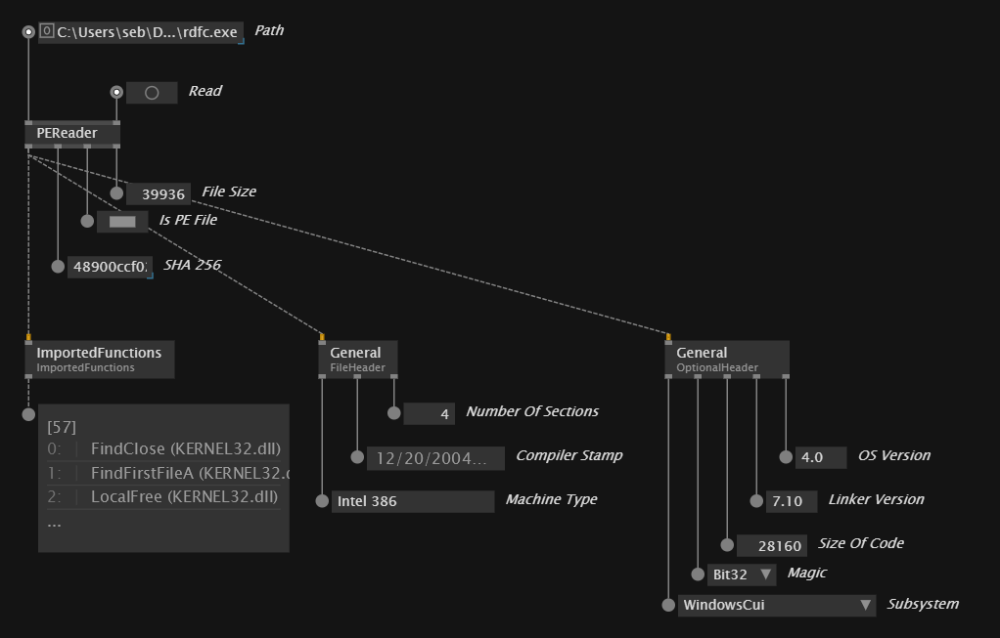

# VL.PeNet

A partial vvvv wrapper of the excellent [`PeNet`](https://github.com/secana/PeNet), a [Portable Executable](https://en.wikipedia.org/wiki/Portable_Executable) parser for .NET.

> [!NOTE]  
> This library is a work in progress for learning purposes and its structure will likely change significantly. Missing features may be added later. If you have a feature request, please get in touch!



## Usage

- Install required dependencies
```
nuget install PeNet
```
- Clone this repo as a submodule or to your `--package-repositories` folder